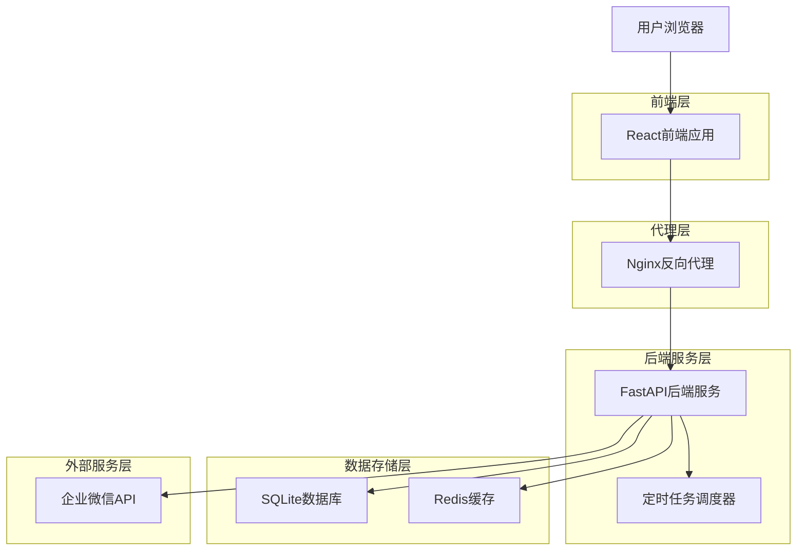
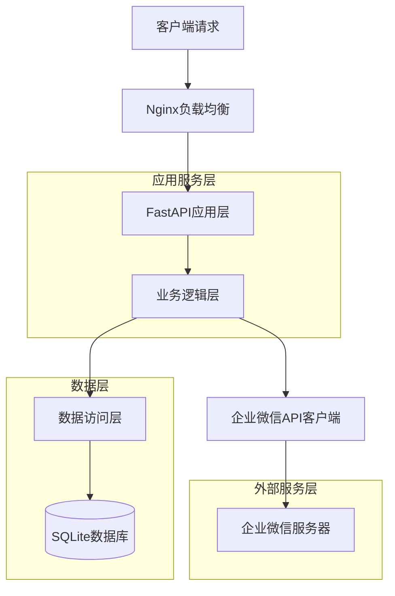
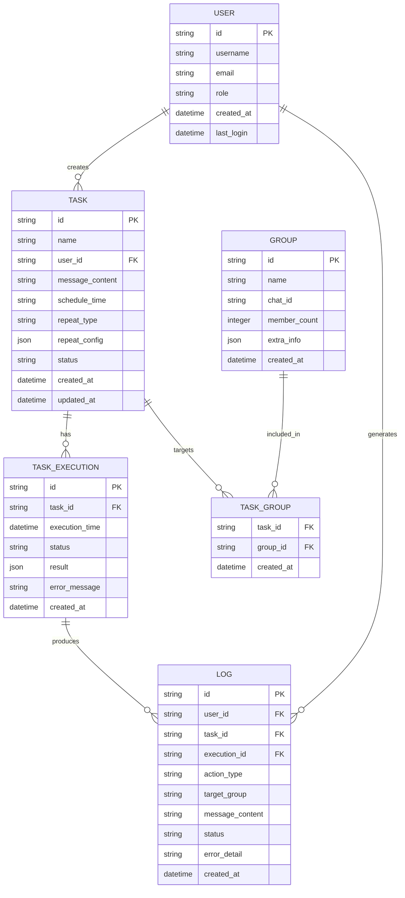

## 1. 架构设计



## 2. 技术描述

- **前端**: React@18 + TypeScript + Ant Design@5 + Vite
- **初始化工具**: vite-init
- **后端**: Python@3.9 + FastAPI@0.104 + Uvicorn
- **数据库**: SQLite3（轻量级，便于部署）
- **缓存**: Redis@7（会话存储和任务队列）
- **任务调度**: APScheduler@3.10（定时任务管理）
- **企业微信SDK**: wechaty@0.10（企业微信API封装）

## 3. 路由定义

| 路由 | 用途 |
|------|------|
| / | 登录页面，企业微信扫码登录 |
| /dashboard | 控制台首页，系统概览 |
| /groups | 群组管理页面，查看和选择群组 |
| /message/edit | 消息编辑页面，创建和编辑消息 |
| /tasks/schedule | 定时任务页面，创建定时任务 |
| /tasks/manage | 任务管理页面，管理所有任务 |
| /logs | 操作日志页面，查看发送记录 |
| /api/auth/* | 认证相关API |
| /api/groups/* | 群组管理API |
| /api/messages/* | 消息管理API |
| /api/tasks/* | 任务管理API |
| /api/logs/* | 日志查询API |

## 4. API定义

### 4.1 认证API

**企业微信扫码登录**
```
GET /api/auth/wechat/login
```

响应：
| 参数名 | 参数类型 | 描述 |
|--------|----------|------|
| qr_code | string | 登录二维码URL |
| session_id | string | 会话ID |

**登录状态查询**
```
GET /api/auth/login/status/{session_id}
```

响应：
| 参数名 | 参数类型 | 描述 |
|--------|----------|------|
| status | string | 登录状态（waiting/scanned/confirmed/expired） |
| user_info | object | 用户信息（登录成功时返回） |

### 4.2 群组管理API

**获取群组列表**
```
GET /api/groups/list
```

请求参数：
| 参数名 | 参数类型 | 是否必需 | 描述 |
|--------|----------|----------|------|
| page | integer | false | 页码，默认1 |
| page_size | integer | false | 每页数量，默认20 |
| search | string | false | 搜索关键词 |

响应：
| 参数名 | 参数类型 | 描述 |
|--------|----------|------|
| total | integer | 总数量 |
| groups | array | 群组列表 |

### 4.3 消息管理API

**发送即时消息**
```
POST /api/messages/send
```

请求：
| 参数名 | 参数类型 | 是否必需 | 描述 |
|--------|----------|----------|------|
| group_ids | array | true | 目标群组ID列表 |
| content | string | true | 消息内容 |
| message_type | string | true | 消息类型（text/image/file） |

**保存消息模板**
```
POST /api/messages/templates
```

请求：
| 参数名 | 参数类型 | 是否必需 | 描述 |
|--------|----------|----------|------|
| name | string | true | 模板名称 |
| content | string | true | 模板内容 |
| variables | array | false | 变量定义 |

### 4.4 任务管理API

**创建定时任务**
```
POST /api/tasks/schedule
```

请求：
| 参数名 | 参数类型 | 是否必需 | 描述 |
|--------|----------|----------|------|
| name | string | true | 任务名称 |
| group_ids | array | true | 目标群组ID列表 |
| message_content | string | true | 消息内容 |
| schedule_time | string | true | 执行时间（ISO格式） |
| repeat_type | string | false | 重复类型（once/daily/weekly/monthly） |
| repeat_config | object | false | 重复配置 |

**获取任务列表**
```
GET /api/tasks/list
```

请求参数：
| 参数名 | 参数类型 | 是否必需 | 描述 |
|--------|----------|----------|------|
| status | string | false | 任务状态 |
| page | integer | false | 页码 |
| page_size | integer | false | 每页数量 |

**启停任务**
```
PUT /api/tasks/{task_id}/status
```

请求：
| 参数名 | 参数类型 | 是否必需 | 描述 |
|--------|----------|----------|------|
| status | string | true | 任务状态（active/inactive） |

### 4.5 日志查询API

**获取操作日志**
```
GET /api/logs
```

请求参数：
| 参数名 | 参数类型 | 是否必需 | 描述 |
|--------|----------|----------|------|
| start_time | string | false | 开始时间（ISO格式） |
| end_time | string | false | 结束时间（ISO格式） |
| task_id | string | false | 任务ID |
| status | string | false | 执行状态 |
| page | integer | false | 页码 |
| page_size | integer | false | 每页数量 |

## 5. 服务器架构图



## 6. 数据模型

### 6.1 数据模型定义



### 6.2 数据定义语言

**用户表 (users)**
```sql
-- 创建用户表
CREATE TABLE users (
    id TEXT PRIMARY KEY,
    username TEXT UNIQUE NOT NULL,
    email TEXT UNIQUE,
    password_hash TEXT,
    role TEXT DEFAULT 'user' CHECK (role IN ('admin', 'manager', 'user')),
    wechat_user_id TEXT,
    avatar_url TEXT,
    is_active BOOLEAN DEFAULT 1,
    created_at TIMESTAMP DEFAULT CURRENT_TIMESTAMP,
    updated_at TIMESTAMP DEFAULT CURRENT_TIMESTAMP,
    last_login TIMESTAMP
);

-- 创建索引
CREATE INDEX idx_users_username ON users(username);
CREATE INDEX idx_users_role ON users(role);
CREATE INDEX idx_users_wechat ON users(wechat_user_id);
```

**群组表 (groups)**
```sql
-- 创建群组表
CREATE TABLE groups (
    id TEXT PRIMARY KEY,
    name TEXT NOT NULL,
    chat_id TEXT UNIQUE NOT NULL,
    member_count INTEGER DEFAULT 0,
    group_type TEXT DEFAULT 'group',
    owner_id TEXT,
    extra_info TEXT,
    created_at TIMESTAMP DEFAULT CURRENT_TIMESTAMP,
    updated_at TIMESTAMP DEFAULT CURRENT_TIMESTAMP
);

-- 创建索引
CREATE INDEX idx_groups_chat_id ON groups(chat_id);
CREATE INDEX idx_groups_name ON groups(name);
```

**任务表 (tasks)**
```sql
-- 创建任务表
CREATE TABLE tasks (
    id TEXT PRIMARY KEY,
    name TEXT NOT NULL,
    user_id TEXT NOT NULL,
    message_content TEXT NOT NULL,
    schedule_time TIMESTAMP NOT NULL,
    repeat_type TEXT DEFAULT 'once' CHECK (repeat_type IN ('once', 'daily', 'weekly', 'monthly', 'custom')),
    repeat_config TEXT,
    status TEXT DEFAULT 'active' CHECK (status IN ('active', 'inactive', 'completed', 'failed')),
    next_execution_time TIMESTAMP,
    last_execution_time TIMESTAMP,
    execution_count INTEGER DEFAULT 0,
    success_count INTEGER DEFAULT 0,
    failure_count INTEGER DEFAULT 0,
    created_at TIMESTAMP DEFAULT CURRENT_TIMESTAMP,
    updated_at TIMESTAMP DEFAULT CURRENT_TIMESTAMP,
    FOREIGN KEY (user_id) REFERENCES users(id)
);

-- 创建索引
CREATE INDEX idx_tasks_user_id ON tasks(user_id);
CREATE INDEX idx_tasks_status ON tasks(status);
CREATE INDEX idx_tasks_next_execution ON tasks(next_execution_time);
CREATE INDEX idx_tasks_schedule_time ON tasks(schedule_time);
```

**任务群组关联表 (task_groups)**
```sql
-- 创建任务群组关联表
CREATE TABLE task_groups (
    task_id TEXT NOT NULL,
    group_id TEXT NOT NULL,
    created_at TIMESTAMP DEFAULT CURRENT_TIMESTAMP,
    PRIMARY KEY (task_id, group_id),
    FOREIGN KEY (task_id) REFERENCES tasks(id) ON DELETE CASCADE,
    FOREIGN KEY (group_id) REFERENCES groups(id) ON DELETE CASCADE
);

-- 创建索引
CREATE INDEX idx_task_groups_task_id ON task_groups(task_id);
CREATE INDEX idx_task_groups_group_id ON task_groups(group_id);
```

**任务执行记录表 (task_executions)**
```sql
-- 创建任务执行记录表
CREATE TABLE task_executions (
    id TEXT PRIMARY KEY,
    task_id TEXT NOT NULL,
    execution_time TIMESTAMP NOT NULL,
    status TEXT NOT NULL CHECK (status IN ('pending', 'running', 'success', 'failed', 'cancelled')),
    result_detail TEXT,
    error_message TEXT,
    target_groups TEXT,
    message_snapshot TEXT,
    execution_duration INTEGER,
    retry_count INTEGER DEFAULT 0,
    created_at TIMESTAMP DEFAULT CURRENT_TIMESTAMP,
    FOREIGN KEY (task_id) REFERENCES tasks(id) ON DELETE CASCADE
);

-- 创建索引
CREATE INDEX idx_executions_task_id ON task_executions(task_id);
CREATE INDEX idx_executions_status ON task_executions(status);
CREATE INDEX idx_executions_execution_time ON task_executions(execution_time);
```

**操作日志表 (logs)**
```sql
-- 创建操作日志表
CREATE TABLE logs (
    id TEXT PRIMARY KEY,
    user_id TEXT NOT NULL,
    task_id TEXT,
    execution_id TEXT,
    action_type TEXT NOT NULL,
    target_type TEXT,
    target_id TEXT,
    target_name TEXT,
    message_content TEXT,
    status TEXT NOT NULL,
    error_detail TEXT,
    ip_address TEXT,
    user_agent TEXT,
    created_at TIMESTAMP DEFAULT CURRENT_TIMESTAMP,
    FOREIGN KEY (user_id) REFERENCES users(id),
    FOREIGN KEY (task_id) REFERENCES tasks(id),
    FOREIGN KEY (execution_id) REFERENCES task_executions(id)
);

-- 创建索引
CREATE INDEX idx_logs_user_id ON logs(user_id);
CREATE INDEX idx_logs_task_id ON logs(task_id);
CREATE INDEX idx_logs_action_type ON logs(action_type);
CREATE INDEX idx_logs_created_at ON logs(created_at);
```

## 7. 部署配置

### 7.1 Nginx配置
```nginx
server {
    listen 80;
    server_name 43.153.88.215;
    root /www/wwwroot/WxWork/dist;
    
    # 前端静态文件
    location / {
        try_files $uri $uri/ /index.html;
    }
    
    # API代理
    location /api {
        proxy_pass http://127.0.0.1:8000;
        proxy_set_header Host $host;
        proxy_set_header X-Real-IP $remote_addr;
        proxy_set_header X-Forwarded-For $proxy_add_x_forwarded_for;
        proxy_set_header X-Forwarded-Proto $scheme;
    }
    
    # WebSocket支持
    location /ws {
        proxy_pass http://127.0.0.1:8000;
        proxy_http_version 1.1;
        proxy_set_header Upgrade $http_upgrade;
        proxy_set_header Connection "upgrade";
    }
}
```

### 7.2 环境变量配置
```bash
# .env文件
WECHAT_CORP_ID=your_corp_id
WECHAT_CORP_SECRET=your_corp_secret
WECHAT_AGENT_ID=your_agent_id

# 数据库配置
DATABASE_URL=sqlite:///./wxwork.db
REDIS_URL=redis://localhost:6379/0

# 应用配置
SECRET_KEY=your_secret_key_here
ALGORITHM=HS256
ACCESS_TOKEN_EXPIRE_MINUTES=30

# 日志配置
LOG_LEVEL=INFO
LOG_FILE=logs/app.log
```

### 7.3 部署脚本
```bash
#!/bin/bash
# deploy.sh

# 停止现有服务
sudo systemctl stop wxwork-schedule

# 拉取最新代码
cd /www/wwwroot/WxWork
git pull origin main

# 安装依赖
cd backend
pip install -r requirements.txt

# 构建前端
cd ../frontend
npm install
npm run build

# 数据库迁移
cd ../backend
python -m alembic upgrade head

# 启动服务
sudo systemctl start wxwork-schedule
sudo systemctl restart nginx

echo "部署完成"
```