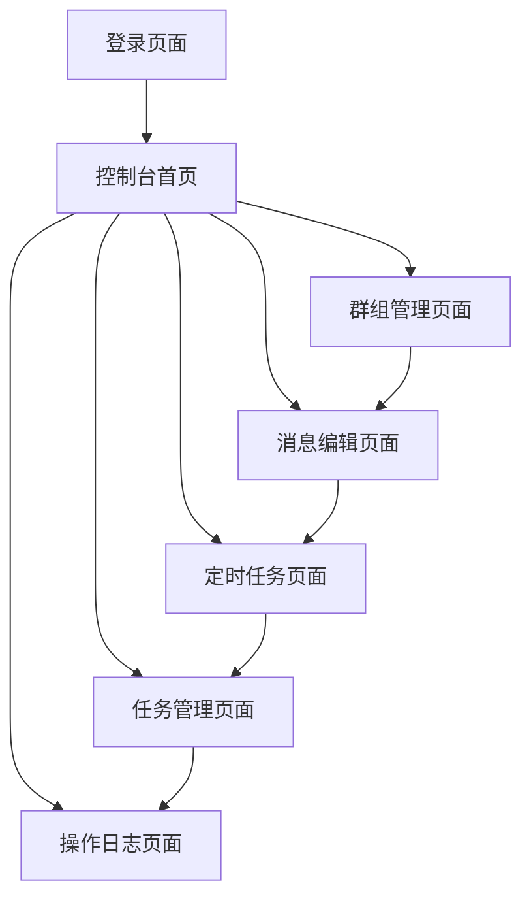

## 1. 产品概述
企业微信定时任务管理系统是一个基于Web的企业级应用，用于自动化管理企业微信消息发送。系统提供扫码登录、群组管理、定时消息发送、任务管理和操作日志等功能，帮助企业高效地进行内部沟通管理。

目标用户为企业管理员和运营人员，通过可视化管理界面简化企业微信的批量消息发送和定时任务管理流程。

## 2. 核心功能

### 2.1 用户角色
| 角色 | 注册方式 | 核心权限 |
|------|----------|----------|
| 系统管理员 | 初始配置 | 全权限管理，包括用户管理、系统配置 |
| 消息管理员 | 管理员创建 | 创建和管理定时任务、编辑消息、查看日志 |
| 普通用户 | 管理员分配 | 查看消息发送状态、基础操作 |

### 2.2 功能模块
系统主要包含以下核心页面：
1. **登录页面**：企业微信扫码登录、用户身份验证
2. **控制台首页**：系统概览、快速操作入口、任务状态统计
3. **群组管理页面**：企业微信群组列表、群组选择、成员查看
4. **消息编辑页面**：富文本编辑器、消息模板、变量替换
5. **定时任务页面**：任务创建、执行时间设置、任务状态管理
6. **任务管理页面**：任务列表、启停控制、编辑删除
7. **操作日志页面**：发送记录、失败重试、日志筛选导出

### 2.3 页面详情
| 页面名称 | 模块名称 | 功能描述 |
|----------|----------|----------|
| 登录页面 | 扫码登录 | 集成企业微信OAuth，支持二维码扫描登录 |
| 登录页面 | 身份验证 | 验证用户身份和权限级别 |
| 控制台首页 | 统计概览 | 显示今日发送量、任务总数、成功率等关键指标 |
| 控制台首页 | 快速操作 | 提供创建任务、查看日志等快捷入口 |
| 群组管理页面 | 群组列表 | 展示企业微信中的所有群组，支持搜索筛选 |
| 群组管理页面 | 群组选择 | 多选框选择目标群组，显示群组成员数量 |
| 消息编辑页面 | 富文本编辑器 | 支持文字、图片、链接等富媒体内容编辑 |
| 消息编辑页面 | 消息模板 | 预设常用消息模板，支持自定义模板保存 |
| 消息编辑页面 | 变量替换 | 支持{用户名}、{日期}等动态变量 |
| 定时任务页面 | 任务创建 | 设置任务名称、选择群组、编辑消息内容 |
| 定时任务页面 | 时间设置 | 支持单次执行、每日、每周、每月等周期设置 |
| 定时任务页面 | 预览确认 | 预览消息效果，确认任务信息 |
| 任务管理页面 | 任务列表 | 展示所有定时任务，包含状态、下次执行时间 |
| 任务管理页面 | 任务控制 | 启用/停用任务、编辑任务内容、删除任务 |
| 任务管理页面 | 批量操作 | 支持批量启用、停用、删除多个任务 |
| 操作日志页面 | 发送记录 | 记录每次消息发送的详细信息 |
| 操作日志页面 | 失败处理 | 显示失败原因，支持手动重试失败的消息 |
| 操作日志页面 | 日志筛选 | 按时间、状态、群组等条件筛选日志 |
| 操作日志页面 | 日志导出 | 支持Excel、CSV格式导出日志数据 |

## 3. 核心流程

### 系统管理员流程
1. 首次登录系统，配置企业微信API凭证
2. 创建消息管理员账号，分配相应权限
3. 监控系统运行状态，查看整体数据统计

### 消息管理员流程
1. 扫码登录系统，进入控制台
2. 在群组管理页面选择目标群组
3. 在消息编辑页面创建消息内容
4. 在定时任务页面设置发送时间和频率
5. 在任务管理页面监控任务执行状态
6. 在操作日志页面查看发送结果和失败记录

### 页面导航流程

## 4. 用户界面设计

### 4.1 设计风格
- **主色调**：企业蓝 (#1890ff) 搭配白色背景
- **辅助色**：成功绿 (#52c41a)、警告橙 (#faad14)、错误红 (#f5222d)
- **按钮样式**：圆角矩形，主要操作为实心按钮，次要操作为边框按钮
- **字体**：系统默认字体，标题16px，正文14px，辅助文字12px
- **布局风格**：左侧导航菜单 + 右侧内容区域的经典管理后台布局
- **图标风格**：使用Ant Design图标库，简洁线性风格

### 4.2 页面设计概述
| 页面名称 | 模块名称 | UI元素 |
|----------|----------|--------|
| 登录页面 | 扫码区域 | 居中显示企业微信二维码，尺寸280x280px，背景白色 |
| 控制台首页 | 统计卡片 | 四宫格布局显示关键指标，卡片带阴影效果 |
| 控制台首页 | 快速操作 | 图标+文字的宫格布局，支持自定义快捷方式 |
| 群组管理页面 | 群组列表 | 表格形式展示，包含群组名称、成员数、创建时间 |
| 群组管理页面 | 搜索筛选 | 顶部搜索框+筛选条件，支持群组名称搜索 |
| 消息编辑页面 | 编辑器 | 富文本编辑器工具栏，支持常用格式和插入图片 |
| 消息编辑页面 | 模板选择 | 下拉框选择预设模板，支持模板预览 |
| 定时任务页面 | 时间选择器 | 日期时间选择器，支持cron表达式输入 |
| 定时任务页面 | 群组选择 | 多选下拉框，显示已选择群组数量 |
| 任务管理页面 | 任务表格 | 行内操作按钮，状态标签使用颜色区分 |
| 任务管理页面 | 批量操作 | 顶部复选框+批量操作按钮组 |
| 操作日志页面 | 日志表格 | 时间、任务名、群组、状态、操作等列 |
| 操作日志页面 | 筛选工具栏 | 时间范围选择器、状态筛选、导出按钮 |

### 4.3 响应式设计
- **桌面优先**：针对1920x1080分辨率优化设计
- **移动端适配**：支持平板和手机访问，采用响应式布局
- **触摸优化**：按钮和交互元素适合触摸操作，最小点击区域44x44px

### 4.4 扩展性设计
- **插件架构**：支持动态加载功能模块
- **主题定制**：支持自定义主题颜色和Logo
- **API扩展**：提供RESTful API供第三方集成
- **权限扩展**：支持细粒度的权限控制和角色自定义